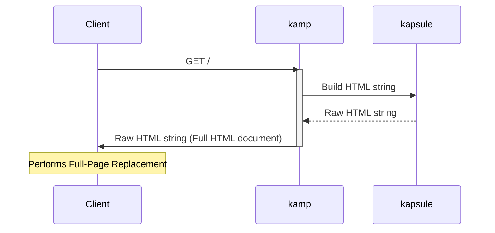

# sakethpathike.github.io

**Full-Page HTML Replacement** _client_ for [kamp](https://github.com/sakethpathike/kamp).

### Request Flow

### Why
- 300ms fade.
- [kamp](https://github.com/sakethpathike/kamp) serves the full page; this plugs it in.